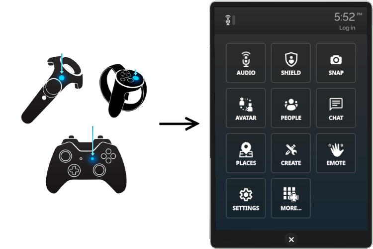
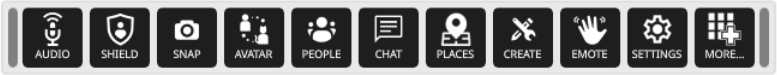

.. warning::
    This document is slightly outdated.
    FIXME: says that lower graphics setting increase performance (not entirely true in our case)

####################
Adjust Your Settings
####################

You can adjust various settings in Overte so that it runs to your preferences. Many of these settings are changed using the HUD (in Desktop mode) or Tablet (in VR mode).

.. contents:: On This Page
    :depth: 2

------------------
The Tablet and HUD
------------------

In VR, all of your settings are found in your **Tablet**. The Tablet also gives you easy access to any :doc:`apps that you install <../personalize/install-apps>`. Pull up the tablet by clicking the menu button on your controller.

In Desktop Mode, rather than the tablet you have a smaller version called the "Heads-up Display" or HUD. It contains the exact same options as the Tablet (settings, apps, etc), but it takes up less space on your screen. if you would rather, you have the option to use the Tablet instead just like in VR. To enable the Tablet, first enable the **Developer** menu by going to **Settings > Developer Menu**. Then, go to **Developer > UI > Desktop Tablet Becomes Toolbar** and toggle it off.

---------------------
Enter or Exit VR Mode
---------------------

You can enjoy Overte with or without VR equipment such as head mounted displays (HMD), hand controllers and audio headsets. Our Desktop mode contains many of Overte's features such as audio, basic movements and gestures, and the ability to travel to different domains.

Keep in mind, however, that the most immersive and powerful experience is when you use VR equipment. Only then will you be able to interact with people in 3D, track body movements, and easily engage with the objects around you. Once you have set up your VR equipment, you can easily switch between VR mode and Desktop mode.

.. note:: In order to use VR you must launch Overte straight into VR first, as Overte will not load VR plugins unnecessarily for desktop users. Once you have launched into VR, you will be able to switch between VR and Desktop mode with ease.

To switch between Desktop and VR mode, you can select it from the Display menu. The menu can be found at the top of your screen when in desktop mode, or on your **Tablet** in VR. Click the **Display** menu, then select your desktop or VR device.

--------------------
Set Your Perspective
--------------------

You can choose how you view things around you by changing your perspective. To change your perspective: 

* In Desktop mode, go to **View** in the menu on the top left corner. 
* In VR mode, open your Tablet and go to **Menu > View**.

+------------------+---------------------------------------------------------------------------------------------------------+
| Setting          | Description                                                                                             |
+==================+=========================================================================================================+
| First Person     | Select this setting if you want to change your perspective in Overte to first person.                   |
|                  | In this view, you will not see yourself, only the environment around you.                               |
+------------------+---------------------------------------------------------------------------------------------------------+
| Third Person     | Select this setting to change your perspective to third person. In this view, you will see              |
|                  | yourself, as well as the environment around you.                                                        |
+------------------+---------------------------------------------------------------------------------------------------------+
| Selfie           | Select this to change your perspective to look at yourself. In this view, you will see yourself and     |
|                  | the space behind you.                                                                                   |
+------------------+---------------------------------------------------------------------------------------------------------+

----------------------------
Other Miscellaneous Settings
----------------------------

Here are some other settings you may like to change to optimize your experience.

^^^^^^^^^^^^^^^^
General Settings
^^^^^^^^^^^^^^^^

You can modify general settings such user interface and privacy settings in Overte. 

* In Desktop mode, go to **Settings > General** in the menu on the top left corner. 
* In VR mode, open your Tablet and go to **Menu > Settings > General**.

^^^^^^^^^^^^^^^^^^^^^^^^^^
In-World Graphics Settings
^^^^^^^^^^^^^^^^^^^^^^^^^^

You can make changes to the graphics in Overte. 

- In Desktop mode, go to **Settings > Graphics** in the menu on the top left corner. 
- In VR mode, open your Tablet and go to **Menu > Settings > Graphics**.

+--------------------+----------------------------------------------------------------------------------------+
| Setting            | Description                                                                            |
+====================+========================================================================================+
| Graphics           | Select the Graphics Preset which best suits your desired performance. Generally a      |
| Preset             | lower graphics setting will sacrifice some visual details for increased performance,   |
|                    | however "Low Power" is intended to reduce the resource usage of Overte to lower its    |
|                    | impact on the rest of your system.                                                     |
+--------------------+----------------------------------------------------------------------------------------+
| Local Lights       | Allow local light sources to light nearby objects.                                     |
+--------------------+----------------------------------------------------------------------------------------+
| Bloom              | Make bright areas look brighter by simulating a light-bleed halo effect around them.   |
+--------------------+----------------------------------------------------------------------------------------+
| Custom Shaders     | Shaders are fancy effects which you may see on avatars or entities in Overte.          |
+--------------------+----------------------------------------------------------------------------------------+
| Deferred Rendering | Advanced rendering technique, primarily for fancy lighting effects.                    |
|                    | You may want to disable this if you have limited memory bandwidth or want to           |
|                    | prioritise anti-aliasing.                                                              |
|                    |                                                                                        |
|                    | With this enabled, the following options are revealed:                                 |
|                    | * Shadows                                                                              |
|                    | * Ambient Occlusion                                                                    |
|                    | * Haze                                                                                 |
+--------------------+----------------------------------------------------------------------------------------+
| Field of View      | Set your field of view using the slider. A higher value lets you see more of your      |
|                    | surroundings.                                                                          |
+--------------------+----------------------------------------------------------------------------------------+
| Resolution         | Adjust the resolution using the slider. This affects how clear Overte appears          |
|                    | on your monitor or screen.                                                             |
+--------------------+----------------------------------------------------------------------------------------+
| Anti-aliasing      | Smooth out the edges on your screen by choosing your anti-aliasing method.             |
|                    |                                                                                        |
|                    | * TAA:                                                                                 |
|                    | * FXAA:                                                                                |
|                    | * MXAA: Note: Not available when Deferred Rendering is enabled.                        |
+--------------------+----------------------------------------------------------------------------------------+
| LOD Settings       | Control the level of detail visible to you in Overte by moving this slider.            |
+--------------------+----------------------------------------------------------------------------------------+
| Refresh Rate       | Choose the frequency that Overte updates its graphics buffers. Most mid-range          |
|                    | computers run well on 'Interactive'.                                                   |
+--------------------+----------------------------------------------------------------------------------------+
| Full Screen        | Select the screen to display Overte on.                                                |
| Display            |                                                                                        |
+--------------------+----------------------------------------------------------------------------------------+
| Allow Camera       | Disable to allow object geometry to block your camera; when enabled your camera may    |
| Clipping           | pass through walls, furniture, avatars or any other entities.                          |
+--------------------+----------------------------------------------------------------------------------------+

| Rendering          | Choose the level of rendering effects that are present in Overte. Local lights,        |
| Effects            | fog, bloom, and shadows are all examples of rendering effects.                         |
+--------------------+----------------------------------------------------------------------------------------+

^^^^^^^^^^^^^^^^^^^^^^^^^
Account Security Settings
^^^^^^^^^^^^^^^^^^^^^^^^^

You can change your account security settings in Overte.

- In Desktop mode, go to **Settings > Security** in the menu on the top left corner. 
- In VR mode, open your Tablet and go to **Menu > Settings > Security**.

+---------------------+----------------------------------------------------------------------------------+
| Setting             | Description                                                                      |
+=====================+==================================================================================+
| Keep Me Logged In   | Enable to stay logged in (in the current device) even if you exit Overte.        |
+---------------------+----------------------------------------------------------------------------------+

**See Also**

+ :doc:`Configure Your Domain Settings <../../host/configure-settings>`
