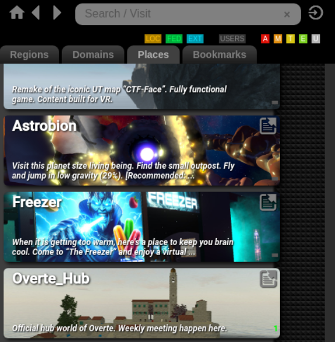
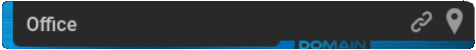

# Travel Between Worlds

Overte is made up of many virtual places that let you participate in activities and interact with the people around you. Many of these places are beautifully detailed worlds that are interesting to explore at any time, while others were built to host events and engage with the people around you.

**On This Page:**
* [Places App](#places-app)
* [Visit a Friend](#visit-a-friend)

## Places App

The **Places** app lets you travel between different places in Overte. Many of our places are created by users just like you.

To go and explore new places:
1. In Interface, pull up your tablet or HUD and go to **Places**.
2. If you know where you want to go, enter the domain address or place name. As you type, only the matching places will be shown. Otherwise, browse the open places under 'Domains' and 'Places'.
3. Click on a place name to go to the place. If you have permissions, you will be transported to that location automatically.

   
Note

   
The places that show up in the Places menu are user-created domains that are open to the public. However, note that the domain owner has full control over the security of their domain and has the ability to ban specific users from a domain. In the rare circumstance that you have been banned, a place may show up in the Places menu, but you will be unable to connect to it if you try to travel there.

### Find other People

Looking for someone to talk to? You can filter the list to just show places with connected users by clicking the 'USERS' button just below the search bar.

### Filter by Maturity Rating

Places in Overte can be marked with a maturity rating to show who they are suitable for.

   
Note

   
Maturity ratings are the responsibility of the domain's author. Whilst a place's rating should ideally reflect the content of that domain, Overte cannot make guarantees as to the content of these independently hosted worlds. A place may also be unrated. You are advised to use your own discretion when exploring these worlds.

You can filter the places list by the ratings you would be comfortable with. In the top right of the Places app window, just below the search bar, you can deselect any ratings to reduce the places in the list to just those which have the ratings selected.

### Bookmarks

If you like the place you are in and want to come back, you can add a bookmark! You can do this at any time from the menu.

* VR: Open your tablet and then the Menu app. **Navigate > Bookmark Location**
* Desktop: At the top of your screen is the menu bar. **Navigate > Bookmark Location**

You can also bookmark your current location from within the Places app, by switching to the **Bookmarks** tab and pressing the **+ Bookmark location** button just below the search bar.

Once you have some bookmarks you will be able to travel to them at any time by selecting them from the **Bookmarks** tab in the Places app.

Each bookmark will denote its type, either *domain* or *serverless* (as is the case for the tutorial world). To the right hand side of each bookmark are it's action buttons.  You can:

* Click on the bookmark title to instantly teleport there
* Select the link icon to copy the place URL.
* Press on the waypoint icon to place down a temporary portal in front of you, which will allow anyone in your current place to travel to your bookmarked location by stepping into the portal.

### Place a portal

Portals allow anyone to travel to their corresponding place from anywhere in the hyperverse! You can place them from the **Bookmarks** tab of the Places app, or by pressing the info button on the top right of the an entry in the **Places** tab, and then **Portal**.

   
Note

   
Any portal you create from the Places app will only remain for a short period of time. This will allow anyone you are with to walk through it to join you in the next place, but anyone who comes by at a later time will not see the portal and cannot follow you in his way.

### Home Sweet Home

Have a favourite spot you in Overte you always want to return to? You can set a home location from the **Bookmarks** tab of the Places app, or from the **Navigate** menu.

You can always get back home either by pressing the house icon in the top left of the Places app, or by heading to the **Navigate** menu, then **Bookmarks** and select **Home**.

If you would like to be in your Home location every time you start Overte, you can set your **Start-Up Location** from the **Navigate** menu.

## Visit a Friend
Once you've [made a friend](socialize.rst#make-connections-and-friends), you can see where they are and even teleport directly to them.

1. In Interface, open your tablet or HUD and go to **People**.
2. Click 'Connections' and find the friend you want to visit.
3. Select their name then 'Visit'.

**See Also**
+ [Socialize with Others](socialize)
