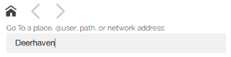

.. warning::
    This document is outdated.
    FIXME: grammar errors

#############################
Bring Visitors to Your Domain
#############################

Now that you have a domain up and running, its time to invite people in to your domain and create your community in the virtual world. Here are some ways to bring more visitors in to your domain.

.. contents:: On This Page
    :depth: 2

-------------------
Invite Your Friends 
-------------------

Nothing is more inviting than a personal invitation to come check out an exciting, new place in the metaverse! Invite your friends with a personal message to visit your domain. 

Share your domain by giving out its IP address or place name. Anyone with an Overte account can enter the place name directly into the Places app to find it, or use a hifi:// address with either your IP address or place name to teleport directly to your domain.

.. note:: TIP: You can send other Overte users hifi:// addresses which send them directly to a location in your domain. Simply click "Navigate" -> "Copy Address to clipboard" and send them the address. When they paste the address into their Places app they will be instantly teleported to where you were when you copied the address.

----------------------------------------------
Add Your Domain to the Places App
----------------------------------------------

The Places app is designed to advertise public domains across the metaverse.

In order to be featured on Overte's Place app, you must add a location marker by opening the app and going to the spot in your domain that you want people to spawn at. In your app, scroll to the bottom and click the "Add Location" button, fill it out and you should be set! You may want to open your domain to the public, such as being open to logged in users or everyone. This means that, in your Domain Settings, under 'Standard Permissions', either the 'anonymous' or 'logged-in' group must have the Connect permission.

To restrict access to your domain, you will need to create a blacklist of users without permission to connect to your domain. This can be set up by username, IP address, MAC address or machine fingerprint.

------------------------------------------
Promote Your Community Event with Overte
------------------------------------------

To get your event or experience added to the calendar on our website, you can submit it to us by joining us on `Matrix<https://matrix.to/#/#overte:overte.org>` or `Discord<https://discord.gg/4YuQvc8K2f>` and reaching out to a Core Team Member.

It will then be:

* Added to Overte's `Events Calendar <https://www.overte.org/events>`_ 
* Promoted on Overte's social channels
